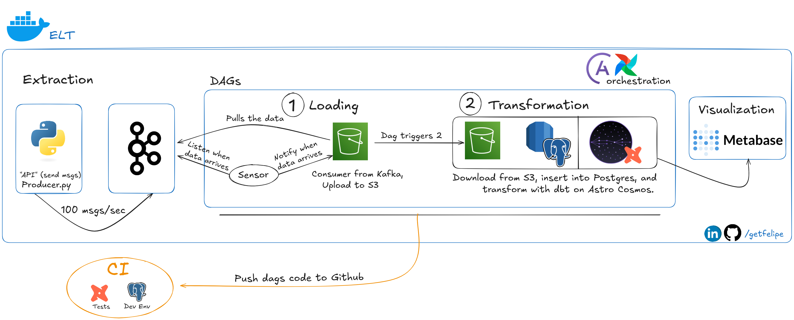
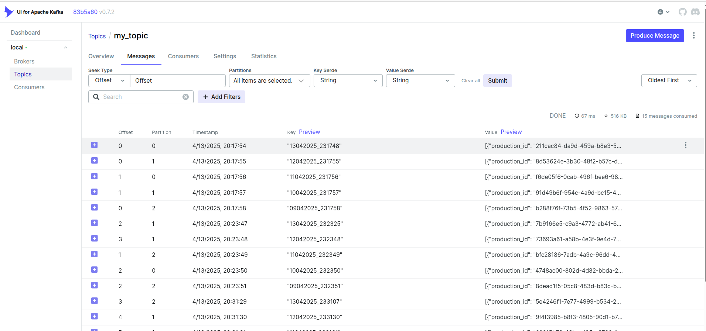
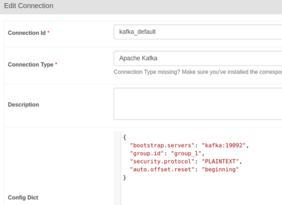
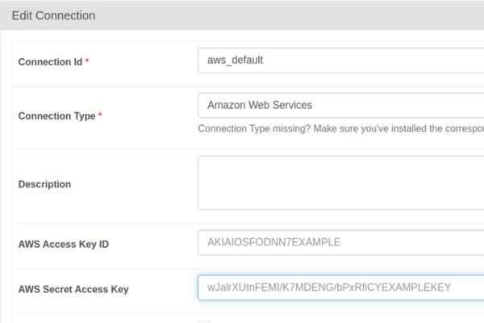
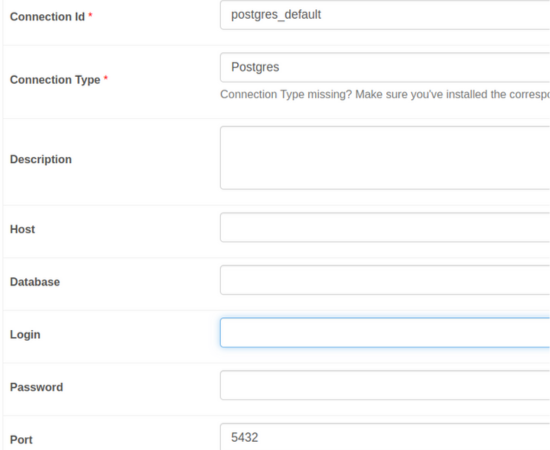
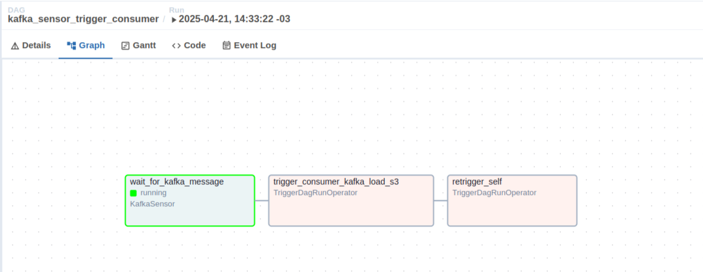
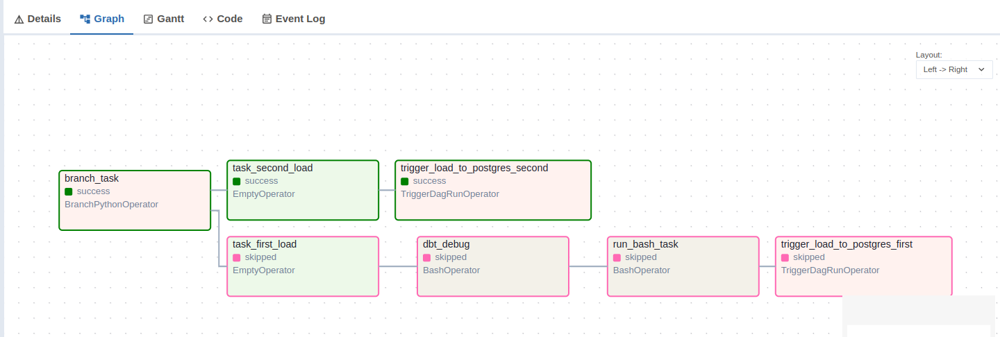
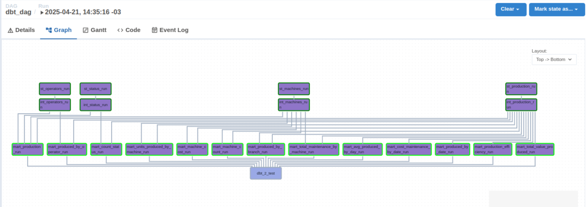
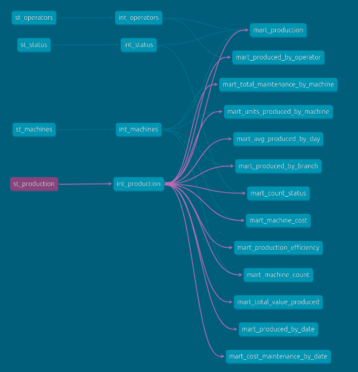
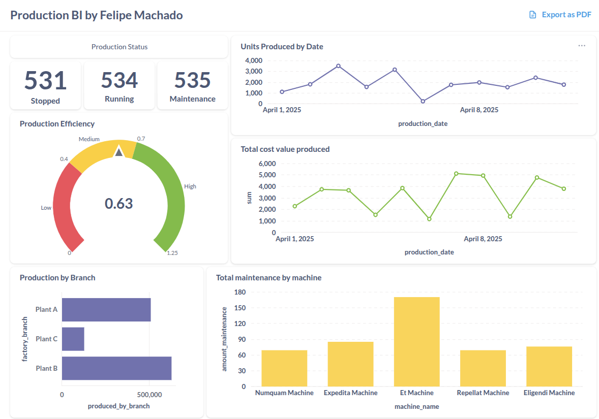

[](https://www.linkedin.com/in/getfelipe/) [](https://www.python.org/downloads/release/python-3120/)

[](https://medium.com/@getfelipe/airflow-astronomer-cosmos-how-to-set-up-dbt-with-apache-airflow-and-run-your-first-dag-13ccb7f79348)

# Real-time ELT

This project has the goal to build real-time ELT pipeline using a script python that sends data to a Kafka topic, where will be consumed by a dag in Airflow, this dag will send this data to S3 bucket then another dag will pull this data from S3 and load to Postgres. To terminate, a dbtdag runs the data transformation. In addition, I used Metabase to create the dashboards with some metrics based on the mart model.

The image below represents the flow of this pipeline:



### Stack

- Apache Kafka – real-time data streaming
- Astro (Airflow) – orchestration of dbt workflows
- dbt with Astro Cosmos – data transformation and testing
- PostgreSQL – data warehouse
- Metabase – dashboard visualization
- Docker – containerized development

### Requirements

- Docker
- AWS Access key & Bucket S3
- [Airflow Astronomer](https://www.astronomer.io/docs/astro/cli/install-cli)
- PostgreSQL connection

### API - Data ingestion (Kafka)

Real-time production data is generated by:
"airflow/codes/producer.py"  
To simulate the data production, It was created this script that sends 500 msgs/sec to Kafka topic.

Firstly, in airflow/codes/Dockerfile, set your PostgreSQL connection up:

```Dockerfile
ENV PGHOST=""
ENV PGDATABASE=""
ENV PGUSER=""
ENV PGPASSWORD=""
ENV PGPORT=""
ENV PGSCHEMA=""
```

To create an image for this script run this following command on terminal within airflow/codes directory:

```bash
# airflow/codes/
docker build -t airflow_ade67f-producer .
```

### Table's Structure

This is the table structure of tables that will be created by API:  
Database schema: maintenance

##### Status Table

| Column Name        | Type    | Description               |
| ------------------ | ------- | ------------------------- |
| status_id          | Integer | Unique status identifier  |
| status_description | String  | Description of the status |

##### Machine List

| Column Name    | Type   | Description               |
| -------------- | ------ | ------------------------- |
| machine_id     | UUID   | Unique machine identifier |
| machine_name   | String | Name of the machine       |
| factory_branch | String | Branch where it's located |

##### Operator List

| Column Name    | Type   | Description                   |
| -------------- | ------ | ----------------------------- |
| operator_id    | UUID   | Unique operator identifier    |
| operator_name  | String | Full name of the operator     |
| operator_cpf   | String | CPF identification number     |
| operator_phone | String | Phone number of the operator  |
| operator_email | String | Email address of the operator |

##### Production List

| Column Name       | Type    | Description                                        |
| ----------------- | ------- | -------------------------------------------------- |
| production_id     | UUID    | Unique identifier for the production record        |
| machine_id        | UUID    | Reference to the machine used                      |
| operator_id       | UUID    | Reference to the operator involved                 |
| production_date   | String  | Date of production in ISO format                   |
| production_value  | Float   | Value of the production in monetary units          |
| production_status | Integer | Status ID (1: Running, 2: Stopped, 3: Maintenance) |
| units_produced    | Integer | Number of units produced                           |
| maintenance       | Boolean | Indicates if maintenance occurred                  |
| maintenance_time  | Float   | Time spent on maintenance                          |
| maintenance_cost  | Float   | Cost of maintenance                                |

### DBT Connection

To set up DBT, create a .dbt folder inside the airflow/ directory, then create a profiles.yml file with the following structure. Fill in your actual connection details:

```yml
# airflow/.dbt/profiles.yml

dbt_2:
  outputs:
    dev:
      dbname:
      host:
      pass:
      port:
      schema:
      threads: 1
      type: postgres
      user:
    prod:
      dbname:
      host:
      pass:
      port: 5432
      schema:
      threads: 1
      type: postgres
      user:
  target: dev
```

### Initializing the services

Now, to run all the services, execute the command below in airflow directory:

```bash
# airflow/

astro dev start
```

#### Note: In Kafka, you can change the number of Brokers and Partitions in the airflow/docker-compose.override.yml file.

### Kafka UI

Open the UI at localhost:8082, look for my_topic in the topics list, click on it, and check the messages



### Airflow Connections

Set the connections in Airflow

#### - kafka_default



#### - aws_default



#### - postgres_default



The execution order of the DAGs is:

```
kafka_sensor_trigger_consumer (to spin up) >> consumer_kafka_load_s3 >> schema_with_seeds >> load_to_postgres >> dbt_dag >> dbt_docs (manually)
```

### Dags

Create a .env file in this directory with the variable BUCKET_NAME, and set it to the name of the bucket to be used in this project:

```env
BUCKET_NAME='YOUR-BUCKET-NAME'
```

#### kafka_sensor_trigger_consumer

This DAG uses a Kafka sensor to wait for messages on a specified Kafka topic.
When a message is received, it triggers another DAG to process the data.
It also retriggers itself to continue listening for new messages.



#### consumer_kafka_load_s3:

Get messages from the Kafka topic and load them into S3.

#### schema_with_seeds:

Create table schemas based on the CSV files generated by the producer and stored in the volume /opt/airflow/dags/dbt_2/seeds/.



#### load_to_postgres:

Iterate over the files loaded into S3 on the current date, select those without the 'proceed' prefix, concatenate their contents, load them into Postgres, and rename the files with the 'proceed' prefix.

#### dbt_dag:

Runs dbt run and dbt test. Creating the following models to perform the transformations:

- staging: Contains only raw data, without any transformations.
- intermediate: Removes duplicate data and validates column integrity.
- mart: Business metrics for use in Metabase.



#### dbt_docs:

Generate and serve dbt documentation locally using BashOperator in Airflow.

#### Model lineage

This is the model lineage of the dbt project that was generated locally by dbt_docs.py:



#### Metabase

Running on localhost:3000, I connected to PostgreSQL and ran some queries on the mart models using Metabase's SQL Editor. I then created a few charts, and the results are shown below:

Some metrics included on the dashboard:

- Production Status
- Production Efficiency
- Production per Branch
- Maintenance Count per Machine
- Units Produced per Day
- Total Production cost



### Architecture Highlights

- Scalable: Easily extendable to production setups (e.g., Kubernetes).
- Production-ready: Includes CI (GitHub Actions), testing (dbt test).

### Room for Improvements

- Deploy to the cloud (e.g., Astronomer, AWS, GCP)
- Add monitoring and alerting (e.g., Prometheus, Grafana)

---

### Documentation

[Airflow Astro - Documention](https://www.astronomer.io/docs/astro/)

[Astronomer Cosmos - Documention](https://astronomer.github.io/astronomer-cosmos/)

#### My post on Medium:

[Airflow Astronomer Cosmos: How to set up dbt with Apache Airflow and run your first DAG](https://medium.com/@getfelipe/airflow-astronomer-cosmos-how-to-set-up-dbt-with-apache-airflow-and-run-your-first-dag-13ccb7f79348)
